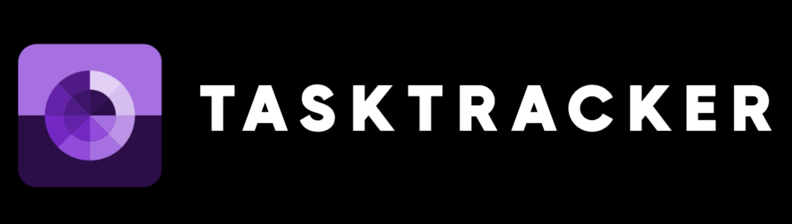

# TaskFlow ✅

TaskFlow is a **fast, minimalistic productivity application** designed to keep you organized and efficient. With a **clean UI**, **smart reminders**, and **seamless sync across devices**, TaskFlow ensures you stay on top of your tasks effortlessly.

## 🚀 Features
- **Simple & Intuitive Interface** – Easily create, manage, and prioritize tasks.
- **Smart Reminders** – Get notified about important deadlines.
- **Cross-Device Sync** – Access your tasks from any device.
- **Task Prioritization** – Set priority levels to stay focused on what matters.
- **Dark Mode Support** – Work comfortably in any lighting condition.

## 🛠 Tech Stack
- **Frontend:** Next.js, React, Tailwind CSS
- **Backend:** Node.js, Express.js
- **Database:** MongoDB
- **Authentication:** Firebase/Auth0
- **Hosting:** Vercel, Cloudflare Workers

## 📖 How to Use
1. **Sign Up/Login** – Create an account to start managing tasks.
2. **Create a Task** – Add tasks with due dates and priorities.
3. **Organize & Prioritize** – Categorize tasks based on importance.
4. **Set Reminders** – Never miss a deadline with smart notifications.
5. **Sync Across Devices** – Stay productive anywhere, anytime.

## 🤝 Contributing
We welcome contributions! Here’s how you can help:
1. **Fork the repository**
2. **Create a feature branch** (`git checkout -b feature-branch`)
3. **Implement your changes**
4. **Commit and push** (`git commit -m 'Add feature' && git push origin feature-branch`)
5. **Open a Pull Request**

## 📬 Support
For assistance, reach out via:
- **GitHub Issues** – Report bugs and suggest features.
- **Email:** tasktrackercom@gmail.com

---
Stay productive and organized with **TaskFlow**! 🚀

